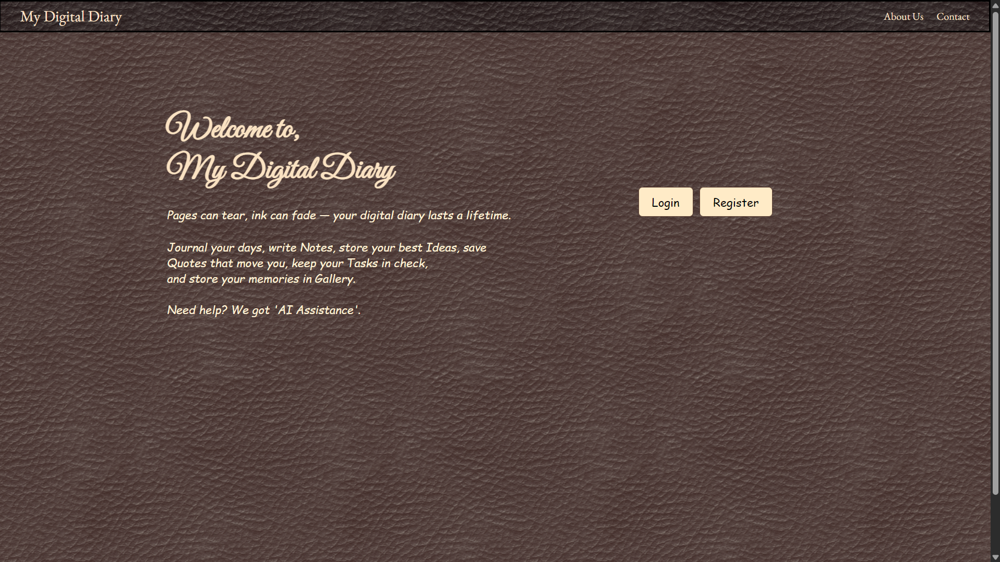
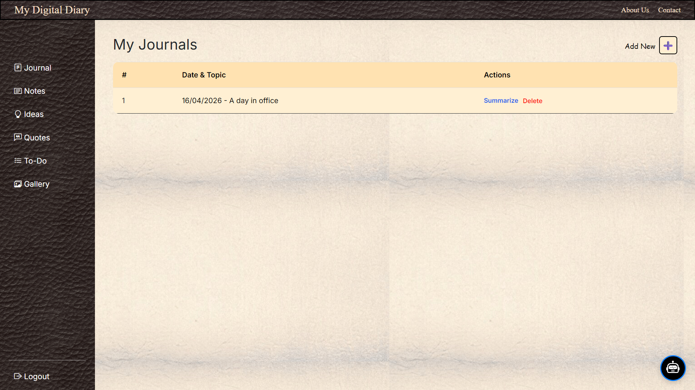
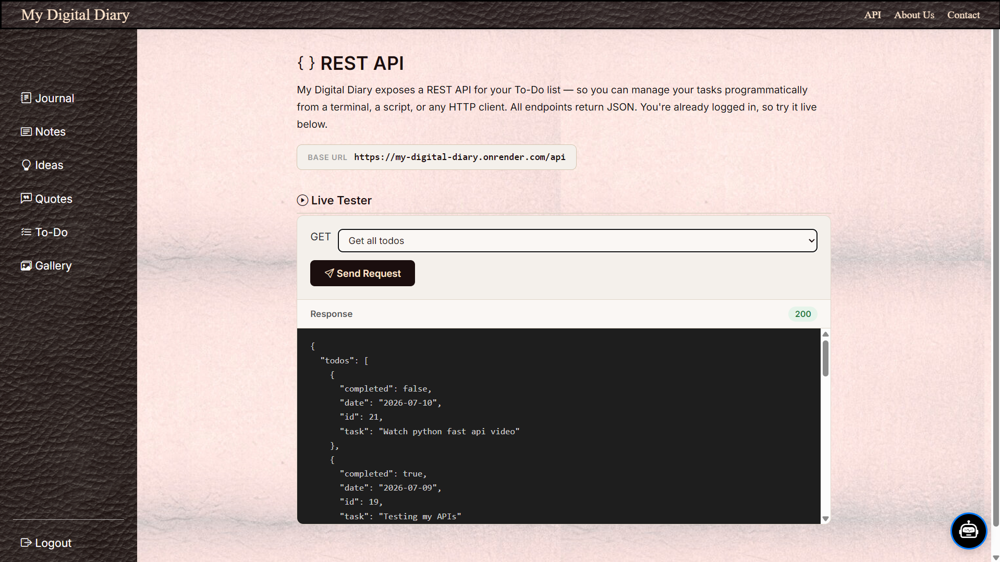

## 📌**Overview:**
My Digital Diary is a full-stack web application that enables users to securely create, manage, and organize their personal diary entries online. The platform eliminates the risk of losing traditional handwritten notes while providing advanced digital features for better productivity. It also integrates AI-powered chat and text summarization, allowing users to quickly review and interact with their entries.

## ✨ **Features:**
1. Task Specific Modules:- Journal, Notes, Ideas, Quotes, To-Do List, Gallery, AI Assistance
2. AI-powered chat assistance for user interaction
3. One click summarization using external AI API
4. User Registration and Authentication
5. Full CRUD operations with database integration
   
## 🛠️ **Tech Stack:**
1. Backend:- Python, Flask
2. Database:- MySQL (Aiven Cloud)
3. Frontend:- HTML, CSS, Bootstrap
4. APIs:- Sarvam AI API
5. Deployment:- Render

## 🧠 **Architecture:**
1. Used Flask Blueprints for modular structure
2. REST API-based backend architecture
3. Template rendering using Jinja2
4. Uses SQLAlchemy ORM for database management.
5. External API integration for AI feature

## 🚀 **Live Demo:**
https://my-digital-diary.onrender.com/

## 📸 **Screenshots:**
### 🏠 Login Page

### 📝 Journal Feature

### 🤖 AI Assistance Feature

## 🤝 **Contributing:**
Contributions are welcome! Feel free to fork the repository and submit a pull request.

## 📬 **Contact:**
Krishnathombare43@gmail.com

⭐**~ If you found this project useful, consider starring the repository!**
